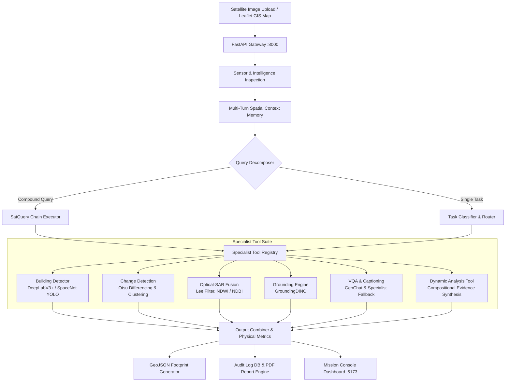

# 🛰️ SatQuery AI: Agentic Remote-Sensing Intelligence Platform

<div align="center">

[](https://www.python.org/)
[](https://fastapi.tiangolo.com/)
[](https://reactjs.org/)
[](https://vitejs.dev/)
[](https://pytorch.org/)
[](https://sih.gov.in/)

**An autonomous, query-driven vision-language assistant for single-image, cross-modal (Optical + SAR), and bi-temporal remote-sensing satellite imagery.**

[Executive Summary](#-executive-summary) • [Tech Stack](#-technology-stack) • [Key Capabilities](#-key-capabilities) • [System Architecture](#-system-architecture) • [Project Structure](#-project-structure) • [Quickstart](#-quickstart--installation)

</div>

---

## 📌 Executive Summary

**SatQuery AI** transforms satellite-image analysis from a manual, tool-heavy GIS process into a natural-language, query-driven autonomous workflow. Engineered specifically for remote-sensing analysts, urban planners, and emergency disaster responders, SatQuery AI eliminates manual GIS software switching by dynamically orchestrating specialized neural networks and physical signal processing pipelines.

### Core Autonomous Workflow:
1. **Sensor & Intelligence Inspection**: Reads raster metadata, band counts, spatial resolution ($\text{m/pixel}$), geographic CRS, and automatically infers input configuration (`single`, `cross_modal`, `bi_temporal`, `compound`).
2. **Intent Classification & Chain Decomposition**: Deconstructs compound user queries into ordered, dependency-tracked tool execution graphs (*"SatQuery Chains"*).
3. **Cross-Modal Signal Processing & Deep Learning**: Combines physics-based remote sensing algorithms (Lee despeckle filtering, NDWI/NDBI/NDVI indexing, Otsu differencing) with neural segmentation (DeepLabV3+, SpaceNet YOLO) and text-guided spatial grounding.
4. **Resilient Spatial Alignment**: Automatically co-registers and bilinearly resamples mismatched Optical and SAR imagery grids (e.g. Optical $800 \times 440$ vs. SAR $1087 \times 860$) before executing fusion computations.
5. **Auditable Evidence & Research Reporting**: Emits physical metrics ($\text{m}^2$, $\text{ha}$, $\text{km}^2$, building counts, spatial change percentages), interactive GeoJSON vector overlays, SQLite audit logs, and downloadable ISRO/research-grade PDF reports.

---

## 🛠️ Technology Stack

| Component / Layer | Technologies & Frameworks Used |
| :--- | :--- |
| **Backend Core Framework** | **Python 3.11+**, **FastAPI** (ASGI Gateway), **Pydantic v2** (Type Safety & Validation), **Uvicorn** (ASGI Server), **SQLite** (Audit Store) |
| **Computer Vision & AI Engine** | **PyTorch 2.2+**, **Torchvision**, **OpenCV** (`cv2`), **GroundingDINO**, **DeepLabV3+**, **SpaceNet YOLO** |
| **Geospatial & Signal Processing** | **Rasterio**, **GDAL**, **SciPy** (`scipy.ndimage`), **Pillow** (PIL), **NumPy** |
| **Frontend Mission Console** | **React 18**, **Vite 5**, **TailwindCSS**, **Leaflet**, **MapLibre GL**, **React-Leaflet** |
| **Report Generation Engine** | **FPDF2** (ISRO & Research-Grade PDF Analysis Reports) |
| **Geocoding & Location Services** | **Nominatim** OpenStreetMap Geocoding API |
| **Deployment & Tooling** | **Docker**, **Docker Compose**, **Virtualenv**, **Git** |

---

## 🚀 Key Capabilities

### 1. 🏢 Neural Building Segmentation & Physical Density Quantification
- **Dual Architecture**: Neural DeepLabV3+ semantic segmentor paired with SpaceNet YOLO remote-sensing instance detector.
- **Tiled Sliding-Window Inference**: Processes large-format satellite rasters ($512 \times 512$ sliding tiles with configurable tile overlap and cross-tile Non-Maximum Suppression).
- **Physical Metrics Conversion**: Converts pixel segmentation masks into real physical units ($\text{m}^2$, $\text{ha}$, $\text{km}^2$) and computes physical building densities ($\text{buildings/km}^2$).
- **GeoJSON Vector Overlays**: Emits interactive GeoJSON polygon footprints enriched with building IDs, confidence scores, and geographic centroids for GIS workspace rendering and QGIS export.

### 2. 🛰️ Cross-Modal Optical + SAR Evidence Fusion
- **Spatial Grid Alignment**: Bilinear resampling engine ensuring co-registration between mismatched Optical and SAR image dimensions prior to NumPy array operations.
- **SAR Despeckling**: Adaptive Lee filter suppressing multiplicative speckle noise while preserving fine urban structural edges.
- **Backscatter Thresholding**: Calibrated thresholding for permanent water bodies ($\le -17.0\,\text{dB}$) and double-bounce high-density urban structures.
- **Spectral Index Integration**: Multi-modal fusion combining NDWI (Water Index), NDBI (Built-up Index), and NDVI (Vegetation Index) with SAR backscatter signatures.
- **Sensor Consensus Scoring**: Calculates cross-sensor agreement scores to resolve optical cloud occlusions using SAR all-weather microwave penetration.

### 3. ⏱️ Bi-Temporal Change Detection & Damage Assessment
- **Co-registered Image Differencing**: Pixel-wise radiance and backscatter diffing across dual timestamps ($T_0$ vs. $T_1$).
- **Data-Driven Thresholding**: Adaptive Otsu thresholding with morphological cleanup (dilation/erosion) to filter single-pixel false positives.
- **Spatial Quantification**: Outputs percentage of scene changed, total hectares altered ($\text{ha}$), count of contiguous change clusters, and compass-based spatial distribution.

### 4. 🧠 Autonomous Agent Controller & "SatQuery Chain"
- **Compound Query Decomposition**: Deconstructs multi-stage analytical queries (e.g. *"Find new construction within 500m of the lake and show SAR evidence"*) into ordered, dependency-tracked tool execution graphs (`Ground` $\rightarrow$ `Buffer AOI` $\rightarrow$ `Change Detect` $\rightarrow$ `SAR Intersect` $\rightarrow$ `Summarize`).
- **Multi-Turn Spatial Context Memory**: Resolves pronouns and spatial referents (*"highlight that cluster"*, *"how large is it?"*, *"what changed there?"*) across multi-turn sessions.
- **Universal AOI Scoping**: Supports user-drawn interactive bounding box crops with strict centroid containment filtering.

### 5. 📑 Auditable Trace & Research Report Generation
- **Execution Trace**: Every intermediate reasoning step, tool decision, and confidence calibration is logged to an immutable SQLite audit store.
- **PDF Report Engine**: Instant generation of research-grade PDF reports complete with metadata, satellite previews, metric tables, and cryptographic execution IDs.

---

## 🏛️ System Architecture



---

## 📂 Project Structure

```
SATQUERY-AI/
├── backend/
│   ├── app/
│   │   ├── config.py                 # Central configurations, model paths & thresholds
│   │   ├── main.py                   # FastAPI backend server & CORS middleware
│   │   ├── schemas.py                # Pydantic models for queries, responses & traces
│   │   ├── controller/
│   │   │   ├── agent_controller.py   # Primary agentic remote-sensing controller
│   │   │   ├── chain_executor.py     # Multi-step SatQuery Chain execution engine
│   │   │   ├── classifier.py         # Query intent classifier & task router
│   │   │   ├── context_memory.py     # Multi-turn spatial memory store
│   │   │   ├── dynamic_planner.py    # Dynamic evidence requirement planner
│   │   │   ├── query_decomposer.py   # Compound query dependency planner
│   │   │   └── validator.py          # Modality and input format validator
│   │   ├── routers/
│   │   │   ├── geocoding.py          # Nominatim reverse/forward geocoding API
│   │   │   ├── query.py              # Query execution & PDF download endpoints
│   │   │   └── upload.py             # File upload and preview streaming API
│   │   ├── services/
│   │   │   ├── audit_log.py          # SQLite audit trail manager
│   │   │   ├── change_processing.py  # Co-registered diffing & Otsu thresholding
│   │   │   ├── change_stats.py       # Change detection metrics & area calculations
│   │   │   ├── evaluation_metrics.py # Model evaluation & benchmark statistics
│   │   │   ├── geospatial_utils.py   # Coordinate conversions, GeoJSON & physical area
│   │   │   ├── image_io.py           # GeoTIFF/PNG reading & preview streaming
│   │   │   ├── optical_processing    # Optical land cover spectral processing
│   │   │   ├── report.py             # FPDF2 report generator
│   │   │   ├── report_generator.py   # Research-grade report metadata builder
│   │   │   ├── sar_processing.py     # Lee despeckling & SAR index computation
│   │   │   ├── sensor_intelligence.py# Rasterio sensor inspection & workflow inference
│   │   │   └── threshold_calibration.py # Grid-search spectral threshold optimizer
│   │   └── tools/
│   │       ├── aoi_tools.py          # AOI crop & centroid containment
│   │       ├── base.py               # Base tool contract interface
│   │       ├── change_detection.py   # Bi-temporal change detection tool
│   │       ├── dynamic_analysis_tool.py # Compositional dynamic analysis specialist
│   │       ├── grounding.py          # Text-guided spatial grounding tool
│   │       ├── object_counting.py    # DeepLabV3+ & SpaceNet building segmentor
│   │       ├── sar_fusion.py         # Optical-SAR fusion specialist
│   │       └── vqa_caption.py        # VQA with graceful specialist fallback
│   ├── data/                         # Uploads, models, reports & audit store
│   ├── scratch/                      # Persisted scratch & test scripts
│   ├── requirements.txt              # Python dependencies
│   └── tests/                        # Automated regression & integration test suite
│
├── frontend/
│   ├── src/
│   │   ├── api/                      # Axios backend API client
│   │   ├── components/
│   │   │   ├── BiTemporalWorkspace.jsx # Dual-date change detection viewport
│   │   │   ├── ConfidenceBadge.jsx   # Honest confidence indicator
│   │   │   ├── OpticalSarWorkspace.jsx # Dual synchronized Optical | SAR viewport
│   │   │   ├── QueryBox.jsx          # Query input & chain step visualizer
│   │   │   ├── SatelliteMapWorkspace.jsx # Interactive Leaflet/SVG AOI workspace
│   │   │   └── UploadPanel.jsx       # Multi-modal slot upload manager
│   │   ├── pages/
│   │   │   └── Dashboard.jsx         # 3-column Mission Console
│   │   ├── App.jsx
│   │   └── main.jsx
│   ├── package.json
│   ├── tailwind.config.js
│   └── vite.config.js
│
├── POSITIONING.md                    # Research positioning & defense guide
└── docker-compose.yml                # Unified multi-container orchestration
```

---

## ⚡ Quickstart & Installation

### Prerequisites
- **Python**: `3.11` or higher
- **Node.js**: `18.x` or higher
- **Git**

### Option A: Local Development Setup

#### 1. Clone Repository
```bash
git clone https://github.com/anguabishek17/SATQUERY-AI.git
cd SATQUERY-AI
```

#### 2. Backend Setup
```bash
cd backend
python -m venv venv

# Windows PowerShell:
.\venv\Scripts\Activate.ps1
# Linux/macOS:
# source venv/bin/activate

pip install --upgrade pip
pip install -r requirements.txt
```

Launch the backend server:
```bash
uvicorn app.main:app --reload --port 8000
```
*API documentation will be live at `http://localhost:8000/docs`.*

#### 3. Frontend Setup
In a new terminal:
```bash
cd frontend
npm install
npm run dev
```
*Mission Console will be live at `http://localhost:5173`.*

---

### Option B: Docker Deployment

Run both backend and frontend via Docker Compose:
```bash
docker compose up --build
```

---

## 📊 API Endpoints

| Method | Endpoint | Description |
| :--- | :--- | :--- |
| `POST` | `/api/upload` | Uploads single, cross-modal, or bi-temporal satellite image files. |
| `GET` | `/api/upload/{file_id}/preview` | Streams preview of uploaded GeoTIFF/PNG for the map viewport. |
| `POST` | `/api/query` | Executes natural-language queries against uploaded imagery. |
| `GET` | `/api/query/{report_id}/trace` | Fetches the full JSON execution trace of a specific analysis turn. |
| `GET` | `/api/query/{report_id}/report.pdf` | Generates and downloads the verified PDF research report. |
| `GET` | `/api/geocoding/search` | Forward geocoding to navigate the satellite map to world coordinates. |
| `GET` | `/api/health` | Healthcheck endpoint for system status. |

---

## 🧪 Automated Testing & Verification

SatQuery AI includes automated regression and verification suites to guarantee model integrity, cross-modal alignment, zero-false-positive boundaries, and AOI containment:

```bash
# Run backend test suite:
cd backend
$env:PYTHONPATH="." ; python tests/test_river.py

# Run benchmark evaluation suite:
python benchmark_evaluation.py
```

### 📊 Validated Benchmark & Verification Suite:
- **Cross-Modal Spatial Alignment**: Automatic co-registration and bilinear resampling for mismatched Optical and SAR image dimensions (e.g. Optical $800 \times 440$ vs. SAR $1087 \times 860$) before signal processing operations.
- **Water Scene Zero-False-Positive Test**: $0$ building detections over water bodies ($\text{density} = 0.0/\text{km}^2$).
- **Hosur Benchmark Scene**: $10$ buildings detected across full scene ($34.25\,\text{ha}$ area, physical density $29.2\,\text{buildings/km}^2$).
- **AOI Centroid Isolation**: $100\%$ spatial containment guarantee (zero out-of-boundary leakage).
- **Audit Trace & PDF Verification**: Immutable SQLite audit log tracking and automated research-grade PDF report compilation.

### 🗺️ Test Dataset

Curated satellite scenes for testing and evaluating SatQuery AI are available in [`test_images/`](test_images/):
- **Building Detection & Density**: Single-scene urban and industrial rasters for YOLO-based building segmentation and density estimation.
- **Spatial Reasoning & Land-Use Interpretation**: Multi-class urban, river, vegetation, and farmland transition scenes for contextual landscape analysis.
- **Optical + SAR Analysis**: Co-registered Optical ($800 \times 440$) and SAR ($1087 \times 860$) scene pairs for evidence fusion and dynamic spatial grid alignment testing.
- **Evidence-Based Responses**: Benchmark targets for verifying physical metric generation ($\text{ha}, \text{km}^2$), spatial bounding box isolation, and confidence estimation.

For full scene descriptions and usage, see [`test_images/README.md`](test_images/README.md).

---

## 🎯 Positioning & Evaluation (SIH26167)

SatQuery AI is engineered to address the core challenges of the **Smart India Hackathon (SIH26167)** remote-sensing vision-language assistant problem statement:

1. **Verifiable Physical Evidence**: Eliminates hallucinated textual summaries. Every response is paired with physical hectare calculations ($\text{m}^2$, $\text{ha}$, $\text{km}^2$), spatial change percentages, building counts, or cross-modal evidence matrices.
2. **Autonomous Tool Routing & Orchestration**: Removes the burden of manual tool selection from analysts. Modality inspection (single, cross-modal, bi-temporal, compound) and tool routing (`Building Segmentor`, `Optical-SAR Fusion`, `Change Detector`, `Grounding Engine`) happen automatically under the hood.
3. **Calibrated Confidence & Defensive Execution**: Low confidence or uncalibrated neural probability signals are explicitly flagged in the UI mission console and trace logs, backed by defensive error handling that guarantees backend stability.
4. **ISRO/Research-Grade Auditability**: Every turn generates machine-readable outputs (GeoJSON vector layers, structured JSON traces) and downloadable PDF reports for formal documentation.

---

## 👥 Contributors & License

- **Team SatNexus** for Smart India Hackathon (SIH 2026) — Problem Statement **SIH26167**.
- Open-sourced under the [MIT License](LICENSE).
- Contributions, issues, and feature requests are welcome via Pull Requests.
