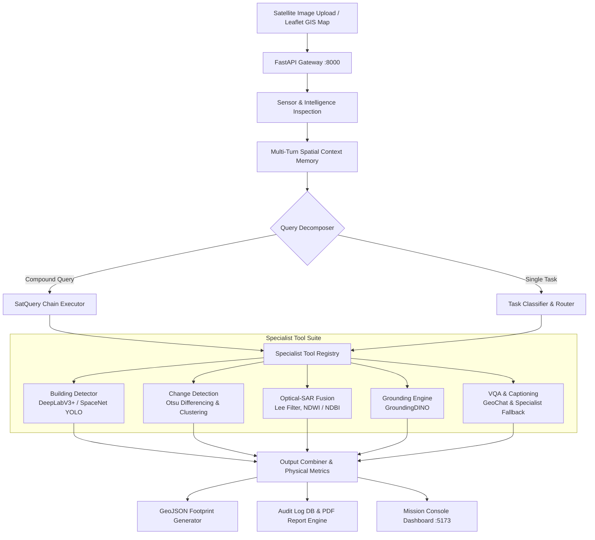

# 🛰️ SatQuery AI: Agentic Remote-Sensing Intelligence Platform

<div align="center">

[](https://www.python.org/)
[](https://fastapi.tiangolo.com/)
[](https://reactjs.org/)
[](https://vitejs.dev/)
[](https://pytorch.org/)
[](https://sih.gov.in/)

**An autonomous, query-driven vision-language assistant for single-image, cross-modal (Optical + SAR), and bi-temporal remote-sensing satellite imagery.**

[Key Features](#-key-capabilities) • [System Architecture](#-system-architecture) • [Quickstart](#-quickstart--installation) • [API Reference](#-api-endpoints) • [Positioning & Innovation](#-positioning--evaluation)

</div>

---

## 📌 Executive Summary

**SatQuery AI** transforms satellite-image analysis from a manual, tool-heavy GIS process into a natural-language, query-driven workflow. Instead of requiring remote sensing analysts to switch between disparate GIS suites, scripts, and model checkpoints, SatQuery autonomously:

1. **Inspects imagery intelligence** (sensor modality, spatial resolution, coordinate reference systems, spectral bands).
2. **Classifies query intent** and decomposes compound questions into dependency-tracked execution plans (*"SatQuery Chains"*).
3. **Orchestrates specialized deep neural engines and physics-based signal processing pipelines** (Building segmentation, Optical-SAR fusion, Bi-temporal change detection, text-guided grounding, and VQA).
4. **Delivers auditable physical evidence** (hectares, square kilometers, physical building density, GeoJSON vector overlays, and downloadable PDF research reports).

---

## 🚀 Key Capabilities

### 1. 🏢 Neural Building Detection & Physical Density Quantification
- **Dual Architecture**: Neural DeepLabV3+ semantic segmentor and SpaceNet YOLO remote-sensing instance detector.
- **Tiled Sliding-Window Inference**: Seamlessly processes large-format satellite images ($512 \times 512$ sliding tiles with configurable overlap and cross-tile Non-Maximum Suppression).
- **Physical Metrics**: Automatically converts pixel masks into real physical units ($\text{m}^2$, $\text{ha}$, $\text{km}^2$) and computes physical building densities ($\text{buildings/km}^2$).
- **Vector Overlays**: Emits interactive GeoJSON polygon footprints for GIS workspace rendering and QGIS export.

### 2. 🛰️ Cross-Modal Optical + SAR Evidence Fusion
- **SAR Despeckling**: Lee-filter despeckling to suppress multiplicative speckle noise while preserving structural edges.
- **Backscatter Thresholding**: Calibrated thresholding for permanent water bodies ($\le -17.0\,\text{dB}$) and double-bounce high-density urban structures.
- **Spectral Indexing**: Integrates NDWI (Normalized Difference Water Index) and NDBI (Normalized Difference Built-up Index).
- **Cross-Sensor Agreement**: Quantifies multi-sensor consensus and flags cloud-covered optical ambiguities using all-weather SAR penetration.

### 3. ⏱️ Bi-Temporal Change Detection & Damage Assessment
- **Co-registered Image Differencing**: Pixel-wise radiance and backscatter diffing across dual timestamps ($T_0$ vs. $T_1$).
- **Data-Driven Thresholding**: Adaptive Otsu thresholding with morphological cleanup (dilation/erosion) to filter single-pixel false positives.
- **Spatial Quantification**: Outputs percentage of scene changed, total hectares altered, count of contiguous change clusters, and primary compass zone of change.

### 4. 🧠 Autonomous Agent Controller & "SatQuery Chain"
- **Compound Query Decomposition**: Deconstructs multi-stage analytical queries (e.g., *"Find new construction within 500m of the lake and show SAR evidence"*) into ordered, dependency-tracked tool execution graphs (`Ground` $\rightarrow$ `Buffer AOI` $\rightarrow$ `Change Detect` $\rightarrow$ `SAR Intersect` $\rightarrow$ `Synthesize`).
- **Multi-Turn Spatial Context Memory**: Resolves pronouns and spatial referents (*"highlight that cluster"*, *"how large is it?"*, *"what changed there?"*) across conversational turns.
- **Universal AOI Scoping**: Supports user-drawn interactive bounding box crops with strict centroid containment filtering.

### 5. 📑 Auditable Trace & Research Report Generation
- **Execution Trace**: Every intermediate reasoning step, tool decision, and confidence calibration is logged to an immutable SQLite audit store.
- **PDF Report Engine**: Instant generation of research-grade PDF reports complete with metadata, satellite previews, metric tables, and cryptographic execution IDs.

---

## 🏛️ System Architecture



---

## 📂 Project Structure

```
SATQUERY-AI/
├── backend/
│   ├── app/
│   │   ├── config.py                 # Central configurations, model paths & thresholds
│   │   ├── main.py                   # FastAPI backend server
│   │   ├── schemas.py                # Pydantic models for queries, responses & traces
│   │   ├── controller/
│   │   │   ├── agent_controller.py   # Primary agentic remote-sensing controller
│   │   │   ├── chain_executor.py     # Multi-step SatQuery Chain execution engine
│   │   │   ├── classifier.py         # Query intent classifier
│   │   │   ├── context_memory.py     # Multi-turn spatial memory store
│   │   │   ├── query_decomposer.py   # Compound query dependency planner
│   │   │   └── validator.py          # Modality and input format validator
│   │   ├── routers/
│   │   │   ├── geocoding.py          # Nominatim reverse/forward geocoding
│   │   │   ├── query.py              # Query execution & PDF download endpoints
│   │   │   └── upload.py             # File upload and preview streaming
│   │   ├── services/
│   │   │   ├── audit_log.py          # SQLite audit trail manager
│   │   │   ├── change_processing.py  # Co-registered diffing & Otsu thresholding
│   │   │   ├── geospatial_utils.py   # Coordinate conversions, GeoJSON & physical area
│   │   │   ├── report.py             # FPDF2 report generator
│   │   │   ├── sar_processing.py     # Lee despeckling & SAR index computation
│   │   │   └── sensor_intelligence.py# Rasterio sensor inspection
│   │   └── tools/
│   │       ├── aoi_tools.py          # AOI crop & centroid containment
│   │       ├── change_detection.py   # Bi-temporal change detection tool
│   │       ├── grounding.py          # Text-guided spatial grounding
│   │       ├── object_counting.py    # DeepLabV3+ & SpaceNet building segmentor
│   │       ├── sar_fusion.py         # Optical-SAR fusion specialist
│   │       └── vqa_caption.py        # VQA with graceful specialist fallback
│   ├── data/                         # Uploads, models, reports & audit store
│   ├── requirements.txt              # Python dependencies
│   └── tests/                        # Automated regression & integration test suite
│
├── frontend/
│   ├── src/
│   │   ├── api/                      # Axios backend API client
│   │   ├── components/
│   │   │   ├── BiTemporalWorkspace.jsx
│   │   │   ├── ConfidenceBadge.jsx
│   │   │   ├── OpticalSarWorkspace.jsx
│   │   │   ├── SatelliteMapWorkspace.jsx # Interactive Leaflet/SVG AOI workspace
│   │   │   └── UploadPanel.jsx       # Multi-modal slot upload manager
│   │   ├── pages/
│   │   │   └── Dashboard.jsx         # 3-column Mission Console
│   │   ├── App.jsx
│   │   └── main.jsx
│   ├── package.json
│   ├── tailwind.config.js
│   └── vite.config.js
│
├── POSITIONING.md                    # Research positioning & defense guide
└── docker-compose.yml                # Unified multi-container orchestration
```

---

## ⚡ Quickstart & Installation

### Prerequisites
- **Python**: `3.11` or higher
- **Node.js**: `18.x` or higher
- **Git**

### Option A: Local Development Setup

#### 1. Clone Repository
```bash
git clone https://github.com/anguabishek17/SATQUERY-AI.git
cd SATQUERY-AI
```

#### 2. Backend Setup
```bash
cd backend
python -m venv venv

# Windows PowerShell:
.\venv\Scripts\Activate.ps1
# Linux/macOS:
# source venv/bin/activate

pip install --upgrade pip
pip install -r requirements.txt
```

Launch the backend server:
```bash
uvicorn app.main:app --reload --port 8000
```
*API documentation will be live at `http://localhost:8000/docs`.*

#### 3. Frontend Setup
In a new terminal:
```bash
cd frontend
npm install
npm run dev
```
*Mission Console will be live at `http://localhost:5173`.*

---

### Option B: Docker Deployment

Run both backend and frontend via Docker Compose:
```bash
docker compose up --build
```

---

## 📊 API Endpoints

| Method | Endpoint | Description |
| :--- | :--- | :--- |
| `POST` | `/api/upload` | Uploads single, cross-modal, or bi-temporal satellite image files. |
| `GET` | `/api/upload/{file_id}/preview` | Streams preview of uploaded GeoTIFF/PNG for the map viewport. |
| `POST` | `/api/query` | Executes natural-language queries against uploaded imagery. |
| `GET` | `/api/query/{report_id}/trace` | Fetches the full JSON execution trace of a specific analysis turn. |
| `GET` | `/api/query/{report_id}/report.pdf` | Generates and downloads the verified PDF research report. |
| `GET` | `/api/geocoding/search` | Forward geocoding to navigate the satellite map to world coordinates. |
| `GET` | `/api/health` | Healthcheck endpoint for system status. |

---

## 🧪 Automated Testing & Verification

SatQuery AI includes automated regression suites to verify model integrity, zero-false-positive boundaries, and AOI containment:

```bash
# Run from backend directory:
$env:PYTHONPATH="." ; python tests/test_river.py
```

**Validated Benchmark Metrics:**
- **Water Scene False Positive Test**: $0$ building detections on water bodies ($\text{density} = 0.0/\text{km}^2$).
- **Hosur Benchmark Scene**: $10$ buildings detected across full scene ($34.25\,\text{ha}$ area, physical density $29.2\,\text{buildings/km}^2$).
- **AOI Centroid Isolation**: $100\%$ spatial containment guarantee (zero out-of-boundary leakage).

---

## 🎯 Positioning & Evaluation (SIH26167)

SatQuery AI was designed to meet the strict evaluation criteria of the **Smart India Hackathon (SIH)** remote-sensing vision-language assistant challenge:

1. **Real Physical Evidence**: Never outputs ungrounded text summaries. Every response is paired with physical hectare calculations, bounding boxes, or raster statistics.
2. **Honest Confidence Calibration**: Low confidence or uncalibrated neural signals are explicitly declared in the UI and trace rather than masquerading behind fake $99\%$ metrics.
3. **Unified Single-Window Interface**: Eliminates model-selection burden for end users—modality routing and tool selection occur automatically under the hood.

---

## 👥 Contributors & License

- Developed by **Team SIH** for Smart India Hackathon.
- Open-sourced under the [MIT License](LICENSE).
