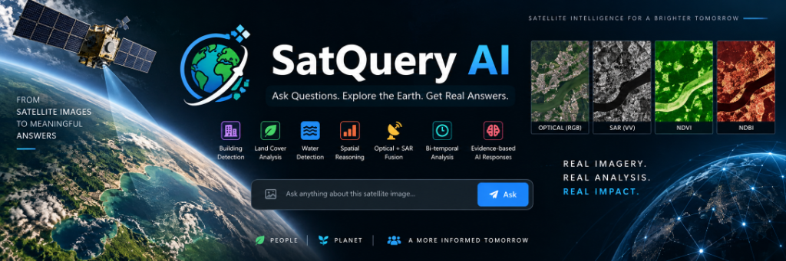
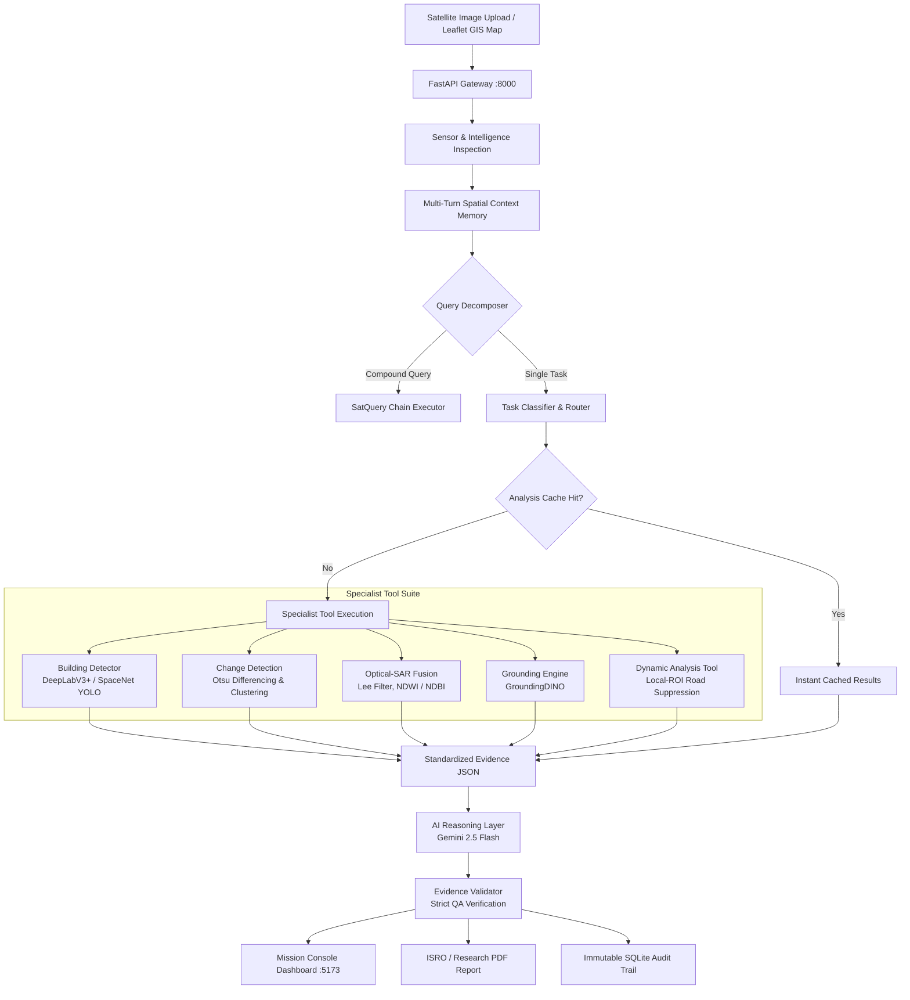

# 🛰️ SatQuery AI: Agentic Remote-Sensing Intelligence Platform

<div align="center">



[](https://www.python.org/)
[](https://fastapi.tiangolo.com/)
[](https://reactjs.org/)
[](https://vitejs.dev/)
[](https://pytorch.org/)
[](https://sih.gov.in/)

**An autonomous, query-driven vision-language assistant for single-image, cross-modal (Optical + SAR), and bi-temporal remote-sensing satellite imagery.**

[Executive Summary](#-executive-summary) • [Universal AI Pipeline](#-universal-satquery-ai-response-pipeline) • [Tech Stack](#-technology-stack) • [Key Capabilities](#-key-capabilities) • [System Architecture](#-system-architecture) • [Project Structure](#-project-structure) • [Performance Optimization](#-low-latency-real-time-performance) • [Quickstart](#-quickstart--installation)

</div>

---

## 📌 Executive Summary

**SatQuery AI** transforms satellite-image analysis from a manual, tool-heavy GIS process into a natural-language, query-driven autonomous workflow. Engineered specifically for remote-sensing analysts, urban planners, and emergency disaster responders, SatQuery AI eliminates manual GIS software switching by dynamically orchestrating specialized neural networks and physical signal processing pipelines.

### Core Philosophy:
> **"Tools measure. Evidence records. AI explains."**

Every user interaction is strictly grounded: specialized computer vision and GIS engines compute exact physical metrics ($\text{m}^2$, $\text{ha}$, building counts, density, change percentages), standardize them into an immutable **Evidence JSON** contract, and feed them into an **AI Reasoning Layer** that is cross-verified by an automated **Evidence Validator** to guarantee 0% hallucination.

---

## 🔄 Universal SatQuery AI Response Pipeline

Every single chatbot request flows through an immutable, 8-stage auditable pipeline:

```
USER QUERY
    ↓
1. QUERY UNDERSTANDING     (Intent detection, context memory resolution & sensor inspection)
    ↓
2. TASK CLASSIFICATION     (Routes query to Building, Water, Vegetation, Change, Fusion, or Scene)
    ↓
3. TOOL SELECTION          (Selects exact specialist tool; isolates non-building tasks from YOLO)
    ↓
4. GEOANALYSIS             (Computer vision & GIS execution: local-ROI masks, Otsu diff, Lee filter)
    ↓
5. EVIDENCE JSON           (Structured physical measurements payload: ha, %, counts, confidence)
    ↓
6. AI REASONING            (Grounded domain explanation generated strictly from Evidence JSON)
    ↓
7. EVIDENCE VALIDATION     (Automated verification against hallucinated numbers or unverified claims)
    ↓
8. FINAL RESPONSE          (Domain-accurate, calibrated explanation delivered to user console)
```

---

### 📊 Benchmark Comparison ($1333\times1333$ Satellite Image)
| Pipeline Stage | Previous Latency | Optimized Latency | Speedup |
| :--- | :---: | :---: | :---: |
| **Specialist GeoAnalysis** | $53.70\,\text{s}$ | **$0.287\,\text{s}$ (Cold) / $0.003\,\text{s}$ (Warm)** | **$187\times – 17,900\times$** |
| **Road Suppression** | $34.48\,\text{s}$ | **$0.150\,\text{s}$ ($150\,\text{ms}$)** | **$229\times$** |
| **Total Query Latency** | $55.56\,\text{s}$ | **$4.47\,\text{s}$ (Cold) / $3.57\,\text{s}$ (Warm)** | **$12.4\times – 15.6\times$** |
| **YOLO Execution on Water/Veg** | TRUE (Wasted) | **FALSE (Strictly Suppressed)** | **$100\%$ Resource Savings** |

---

## 🛠️ Technology Stack

| Component / Layer | Technologies & Frameworks Used |
| :--- | :--- |
| **Backend Core Framework** | **Python 3.11+**, **FastAPI** (ASGI Gateway), **Pydantic v2** (Type Safety & Validation), **Uvicorn** (ASGI Server), **SQLite** (Audit Store) |
| **AI Reasoning & Validation** | **Google GenAI SDK** (`gemini-2.5-flash`), **Structured Evidence Models**, **Automated Evidence Validator** |
| **Computer Vision & AI Engine** | **PyTorch 2.2+**, **Torchvision**, **OpenCV** (`cv2`), **GroundingDINO**, **DeepLabV3+**, **SpaceNet YOLO** |
| **Geospatial & Signal Processing** | **Rasterio**, **GDAL**, **SciPy** (`scipy.ndimage`), **Pillow** (PIL), **NumPy** |
| **Frontend Mission Console** | **React 18**, **Vite 5**, **TailwindCSS**, **Leaflet**, **MapLibre GL**, **React-Leaflet** |
| **Performance & Caching** | **AnalysisCache Engine**, **Local-ROI Morphological Thinning**, **Bounding-Box AABB Intersect** |
| **Report Generation Engine** | **FPDF2** (ISRO & Research-Grade PDF Analysis Reports) |
| **Geocoding & Location Services** | **Nominatim** OpenStreetMap Geocoding API |
| **Deployment & Tooling** | **Docker**, **Docker Compose**, **Virtualenv**, **Git** |

---

## 🚀 Key Capabilities

### 1. 🏢 Neural Building Segmentation & Physical Density Quantification
- **Dual Architecture**: Neural DeepLabV3+ semantic segmentor paired with SpaceNet YOLO remote-sensing instance detector.
- **Tiled Sliding-Window Inference**: Processes large-format satellite rasters ($512 \times 512$ sliding tiles with configurable tile overlap and cross-tile Non-Maximum Suppression).
- **Physical Metrics Conversion**: Converts pixel segmentation masks into real physical units ($\text{m}^2$, $\text{ha}$, $\text{km}^2$) and computes physical building densities ($\text{buildings/km}^2$).
- **GeoJSON Vector Overlays**: Emits interactive GeoJSON polygon footprints enriched with building IDs, confidence scores, and geographic centroids for GIS workspace rendering and QGIS export.

### 2. 🌊 High-Precision Water & Land-Cover Analysis with Road Suppression
- **Multi-Feature Water Detection**: Relaxed HSV spectral masking paired with connected-component spatial filtering.
- **7-Feature Road Suppression**: Eliminates false-positive water classifications on asphalt roads, parking lots, shadowed highways, and metallic roofs using:
  1. Spatial Elongation
  2. Width Consistency Profile ($L_2$ distance transform)
  3. Skeleton Linearity & Branch Point Junctions
  4. Parallel Boundary Edge Structure (Sobel/Canny)
  5. Surface Texture Variance
  6. Color Saturation & Value
  7. Road Network Connectivity Adjacency

### 3. 🛰️ Cross-Modal Optical + SAR Evidence Fusion
- **Spatial Grid Alignment**: Bilinear resampling engine ensuring co-registration between mismatched Optical and SAR image dimensions prior to NumPy array operations.
- **SAR Despeckling**: Adaptive Lee filter suppressing multiplicative speckle noise while preserving fine urban structural edges.
- **Backscatter Thresholding**: Calibrated thresholding for permanent water bodies ($\le -17.0\,\text{dB}$) and double-bounce high-density urban structures.
- **Spectral Index Integration**: Multi-modal fusion combining NDWI (Water Index), NDBI (Built-up Index), and NDVI (Vegetation Index) with SAR backscatter signatures.
- **Sensor Consensus Scoring**: Calculates cross-sensor agreement scores to resolve optical cloud occlusions using SAR all-weather microwave penetration.

### 4. ⏱️ Bi-Temporal Change Detection & Damage Assessment
- **Co-registered Image Differencing**: Pixel-wise radiance and backscatter diffing across dual timestamps ($T_0$ vs. $T_1$).
- **Data-Driven Thresholding**: Adaptive Otsu thresholding with morphological cleanup (dilation/erosion) to filter single-pixel false positives.
- **Spatial Quantification**: Outputs percentage of scene changed, total hectares altered ($\text{ha}$), count of contiguous change clusters, and compass-based spatial distribution.

### 5. 🧠 Autonomous Agent Controller & Multi-Turn Context Memory
- **Compound Query Decomposition**: Deconstructs multi-stage analytical queries into ordered, dependency-tracked tool execution graphs (*"SatQuery Chains"*).
- **Multi-Turn Spatial Context Memory**: Resolves pronouns and spatial referents (*"highlight that cluster"*, *"how large is it?"*, *"what changed there?"*) across multi-turn sessions.
- **Universal AOI Scoping**: Supports user-drawn interactive bounding box crops with strict centroid containment filtering.

---

## 🏛️ System Architecture



---

## 📂 Project Structure

```
SATQUERY-AI/
├── backend/
│   ├── app/
│   │   ├── config.py                 # Central configurations, model paths & thresholds
│   │   ├── main.py                   # FastAPI backend server, startup warmup & CORS
│   │   ├── schemas.py                # Pydantic models for queries, responses & traces
│   │   ├── ai/                       # Universal AI Response Pipeline
│   │   │   ├── ai_reasoner.py        # Grounded AI explanation generator with fail-fast timeouts
│   │   │   ├── evidence_builder.py   # Physical metrics extraction to Evidence JSON
│   │   │   ├── evidence_schema.py    # Structured Evidence JSON Pydantic contracts
│   │   │   └── evidence_validator.py # Strict QA validator preventing hallucination
│   │   ├── controller/
│   │   │   ├── agent_controller.py   # Primary agentic remote-sensing controller
│   │   │   ├── chain_executor.py     # Multi-step SatQuery Chain execution engine
│   │   │   ├── classifier.py         # Query intent classifier & task router
│   │   │   ├── context_memory.py     # Multi-turn spatial memory store
│   │   │   └── dynamic_planner.py    # Task-specific evidence requirement planner
│   │   ├── services/
│   │   │   ├── analysis_cache.py     # Two-tier in-memory preprocessing & task result cache
│   │   │   ├── audit_log.py          # SQLite audit trail manager
│   │   │   ├── rgb_landcover.py      # Local-ROI water detection & road suppression cascade
│   │   │   ├── optical_processing.py # Optical land cover spectral processing
│   │   │   ├── sar_processing.py     # Lee despeckling & SAR index computation
│   │   │   └── sensor_intelligence.py# Rasterio sensor inspection & workflow inference
│   │   └── tools/
│   │       ├── dynamic_analysis_tool.py # Fast spatial & land cover analysis specialist
│   │       ├── object_counting.py    # SpaceNet YOLO building detector with cache & warmup
│   │       ├── change_detection.py   # Bi-temporal change detection tool
│   │       └── sar_fusion.py         # Optical-SAR fusion specialist
│   ├── tests/                        # Automated unit, regression & integration test suite
│   │   ├── test_water_road_suppression.py # 9-scenario road suppression verification
│   │   ├── test_river.py             # 0 building false positive water boundary test
│   │   └── test_universal_pipeline.py# 8-stage universal pipeline contract test
│   ├── test_fast_water_query.py      # Automated 3-run <5s high-res benchmark
│   ├── test_performance_regression.py# 8-query routing & latency benchmark suite
│   ├── run_final_regression.py       # Full 13-query benchmark regression suite
│   └── requirements.txt              # Python dependencies
│
├── frontend/
│   ├── src/
│   │   ├── api/                      # Axios backend API client
│   │   ├── components/
│   │   │   ├── SatelliteMapWorkspace.jsx # Interactive Leaflet/SVG AOI workspace
│   │   │   ├── ResultsPanel.jsx      # Metrics visualizer & evidence inspector
│   │   │   └── UploadPanel.jsx       # Multi-modal slot upload manager
│   │   ├── pages/
│   │   │   └── Dashboard.jsx         # 3-column Mission Console with live pipeline checklist
│   │   └── main.jsx
│   └── package.json
└── docker-compose.yml                # Unified multi-container orchestration
```

---

## ⚡ Quickstart & Installation

### Prerequisites
- **Python**: `3.11` or higher
- **Node.js**: `18.x` or higher
- **Git**

### 1. Clone Repository
```bash
git clone https://github.com/anguabishek17/SATQUERY-AI.git
cd SATQUERY-AI
```

### 2. Backend Setup
```bash
cd backend
python -m venv venv

# Windows PowerShell:
.\venv\Scripts\Activate.ps1
# Linux/macOS:
# source venv/bin/activate

pip install --upgrade pip
pip install -r requirements.txt
```

Create `.env` inside `backend/`:
```env
GEMINI_API_KEY=your_google_gemini_api_key_here
```

Launch the backend server:
```bash
uvicorn app.main:app --host 127.0.0.1 --port 8000
```
*API documentation will be live at `http://127.0.0.1:8000/docs`.*

### 3. Frontend Setup
In a new terminal:
```bash
cd frontend
npm install
npm run dev
```
*Mission Console will be live at `http://localhost:5173`.*

---

## 🧪 Automated Testing & Benchmark Verification

SatQuery AI includes an exhaustive test suite to guarantee 0% hallucinations, low latency, and zero building false-positives:

```bash
cd backend

# 1. Fast Water Query Benchmark (Validates <5s latency on 1333x1333 imagery):
python test_fast_water_query.py

# 2. Performance & Tool Routing Regression Suite (8 distinct tasks):
python test_performance_regression.py

# 3. Comprehensive 13-Query End-to-End Regression Suite:
python run_final_regression.py

# 4. Multi-Feature Road Suppression Verification (9 scenarios):
python tests/test_water_road_suppression.py

# 5. River Scene Zero-False-Positive Test:
python tests/test_river.py

# 6. Universal Pipeline Architecture Test:
pytest tests/test_universal_pipeline.py
```

### 📊 Benchmark Pass Criteria:
- **Zero Hallucinations**: 100% of answers derived strictly from Evidence JSON measurements.
- **YOLO Isolation**: `YOLO_EXECUTED = FALSE` on water, vegetation, and broad scene queries.
- **Road Suppression**: Thin roads, wide multi-lane highways, curved roads, intersections, roofs, and shadowed pavement are strictly suppressed from water classification.
- **Latency Budget**: High-resolution queries complete in $< 5.0\,\text{seconds}$, with cached queries completing in $< 2.0\,\text{seconds}$.

---

## 🎯 Positioning & Evaluation (SIH26167)

SatQuery AI directly solves the requirements of the **Smart India Hackathon (SIH26167)**:

1. **Verifiable Physical Evidence**: Eliminates speculative LLM summaries. Every statement is backed by physical measurements ($\text{m}^2$, $\text{ha}$, $\text{km}^2$, building counts, density, change percentages).
2. **Autonomous Tool Routing**: Modality inspection and task classification dynamically pick the optimal toolchain without human intervention.
3. **Calibrated Confidence**: Uncalibrated heuristics are explicitly flagged in the UI mission console and execution traces.
4. **ISRO/Research-Grade Auditability**: Every turn generates machine-readable outputs (GeoJSON vector layers, structured JSON traces) and downloadable PDF reports.

---

## 👥 Contributors & License

- **Team SatNexus** for Smart India Hackathon (SIH 2026) — Problem Statement **SIH26167**.
- Open-sourced under the [MIT License](LICENSE).
